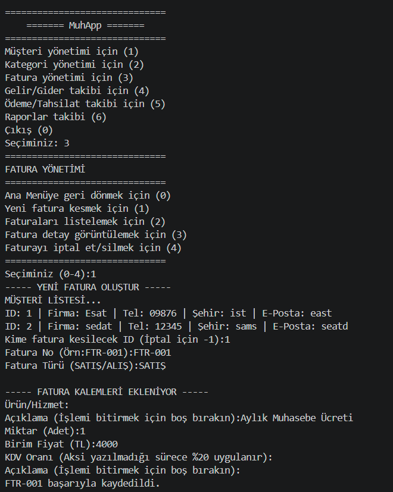
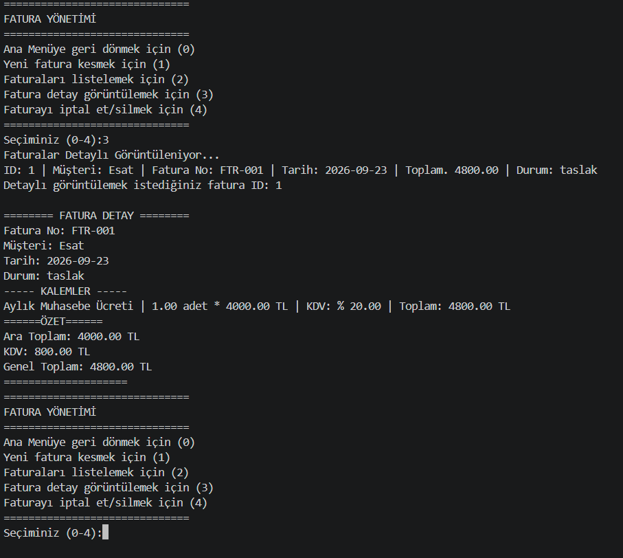

    ███╗   ███╗██╗   ██╗██╗  ██╗ █████╗ ██████╗ ██████╗ 
    ████╗ ████║██║   ██║██║  ██║██╔══██╗██╔══██╗██╔══██╗
    ██╔████╔██║██║   ██║███████║███████║██████╔╝██████╔╝
    ██║╚██╔╝██║██║   ██║██╔══██║██╔══██║██╔═══╝ ██╔═══╝ 
    ██║ ╚═╝ ██║╚██████╔╝██║  ██║██║  ██║██║     ██║     
    ╚═╝     ╚═╝ ╚═════╝ ╚═╝  ╚═╝╚═╝  ╚═╝╚═╝     ╚═╝     
    
    

## 📊 MuhApp - Terminal Tabanlı Muhasebe Uygulaması:

MuhApp, küçük ve orta ölçekli işletmelerin (veya serbest çalışanların) günlük muhasebe işlemlerini terminal üzerinden (CLI) hızlı ve pratik bir şekilde yönetebilmesi için geliştirilmiş bir **Python** uygulamasıdır. 
Sadece bir arayüz programı değil; arka planda **İlişkisel Veritabanı (RDBMS)** mantığı barındıran tam donanımlı bir arka uç (backend) projesidir.

## 🚀 Projenin Amacı ve Neler Öğrendim?

Bu proje, **Python**, **Veritabanı (SQL)** ve **Nesne Yönelimli Programlama (OOP)** yeteneklerimi geliştirmek amacıyla yazılmıştır. Proje geliştirme sürecinde edindiğim temel kazanımlar:
- **SQLAlchemy (ORM) Kullanımı:** Saf SQL yazmak yerine, tabloları Python sınıfları ile modelledim ve yönettim.
- **Veritabanı İlişkileri:** Tablolar arası `One-to-Many` ilişkileri (Örn: Bir Müşterinin birden fazla Faturası olması, Bir Faturanın birden fazla Kalemi olması) başarıyla kurguladım.
- **Session (Oturum) Yönetimi:** Veritabanı bağlantılarını açma, kapama ve `commit/rollback` işlemlerini güvenli bir şekilde sağladım.
- **CLI Kullanıcı Deneyimi:** Siyah ekranda akıcı bir menü tasarımı ve döngü yapıları (`while`, `match-case`) kurdum.
  
## 🛠️ Kullanılan Teknolojiler
- **Dil:** Python (3.10+)
- **Veritabanı:** SQLite (Yerel, hızlı ve portatif)
- **ORM:** SQLAlchemy (Veritabanı modellemesi ve sorguları için)

## 🎯 Özellikler (Modüller)
Uygulama şu an aşağıdaki modülleri aktif olarak desteklemektedir:
1. **👤 Müşteri Yönetimi:** Yeni müşteri ekleme, listeleme, güncelleme ve borç/bakiye tabanlı detaylı müşteri profili görüntüleme.
2. **📁 Kategori Yönetimi:** Gelir ve Gider kategorileri oluşturma (Örn: Ofis Kirası, Satış, Pazarlama).
3. **🧾 Fatura Yönetimi:** 
   - Müşteriye özel, kalem kalem ürün/hizmet ekleyerek fatura oluşturma.
   - Otomatik ara toplam, KDV ve Genel Toplam hesaplaması.
4. **💰 Gelir/Gider (Kasa) Takibi:** Fatura harici ofis harcamalarını veya ek gelirleri kategori bazlı olarak kasaya işleme ve bakiye takibi.
5. **💳 Ödeme / Tahsilat:** Müşteri borçlarından düşülecek şekilde para girişi ve çıkışı.
6. **📈 Raporlar:** Şirketin genel durumunu yansıtacak detaylı istatistik ekranları.

## 💻 Kurulum
1. **Repoyu klonla:**
git clone https://github.com/estyyr/MuhApp.git
cd MuhApp
2. **Gerekli kütüphaneyi yükle:**
pip install sqlalchemy
3. **Veritabanını oluştur:**
python test_db.py
4. **Uygulamayı başlat:**
python main.py

**Not:** Kurulum adımları ve dosya isimleri projenin güncel yapısına göre kontrol edilmelidir.

## 📌 Geliştirme Durumu

**->** MuhApp, geliştirme sürecinde olan bir projedir. Yeni özellikler eklenmesi, mevcut modüllerin iyileştirilmesi ve uygulamanın daha kullanışlı hâle getirilmesi planlanmaktadır.

## 🎯 Gelecek Planları
1. Kullanıcı arayüzünün geliştirilmesi
2. Veritabanı yapısının iyileştirilmesi
3. Muhasebe işlemleri için daha kapsamlı raporlar
4. Veri doğrulama ve hata yönetiminin geliştirilmesi
5. Yeni muhasebe modüllerinin eklenmesi
6. Görüntü işleme özelliği

